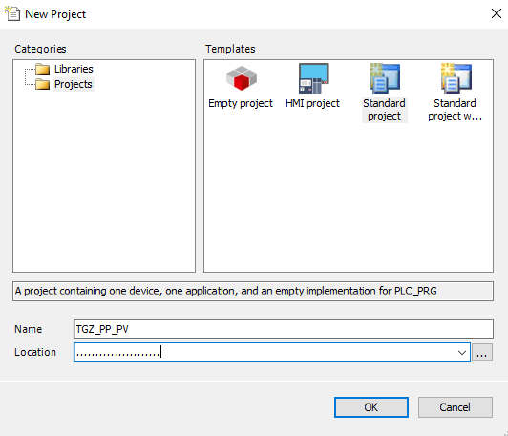
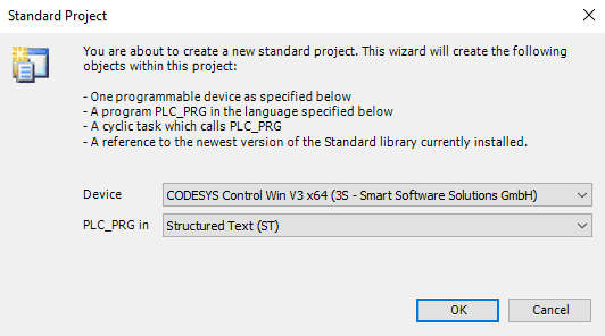
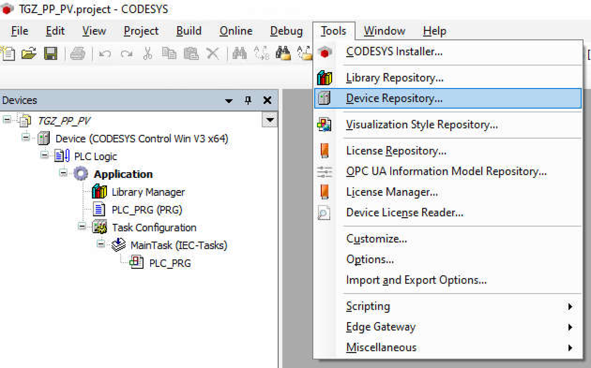
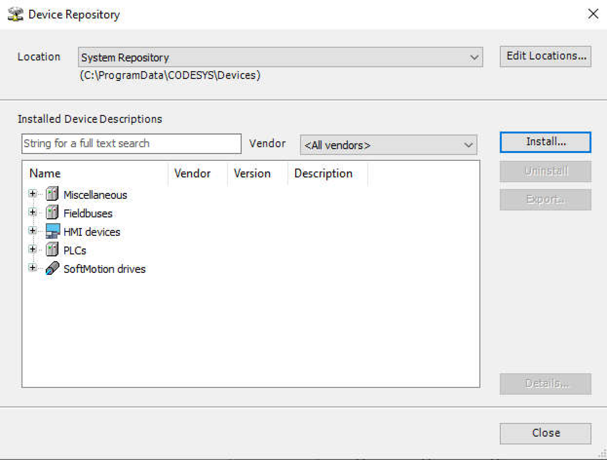
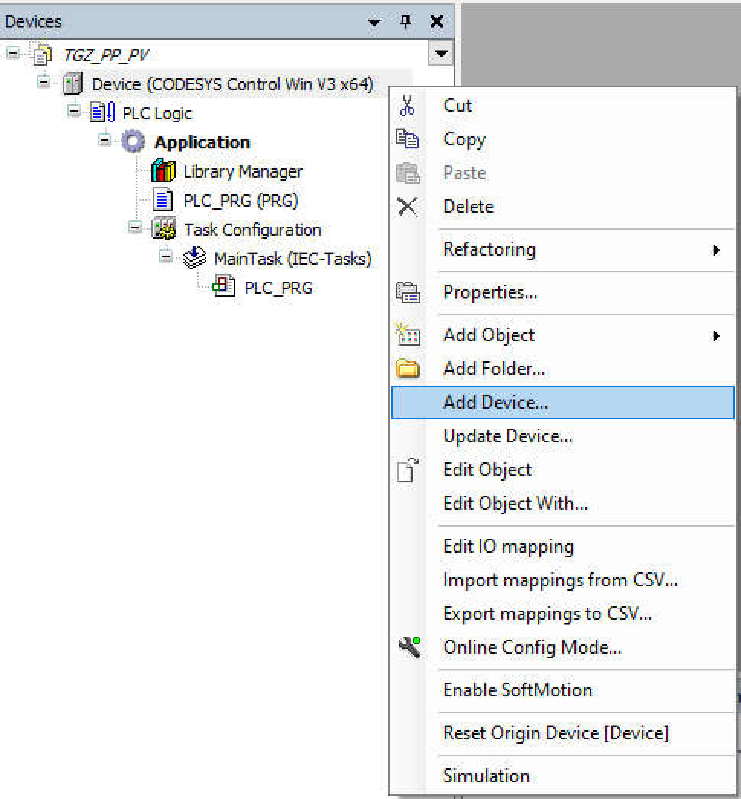
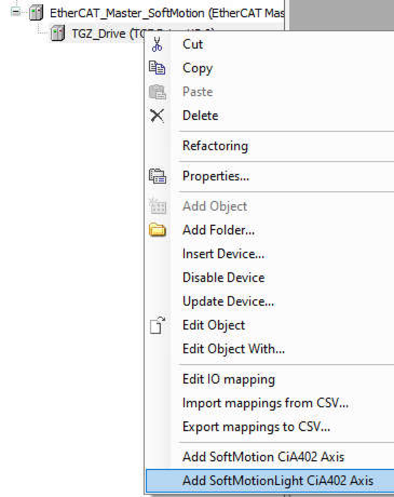
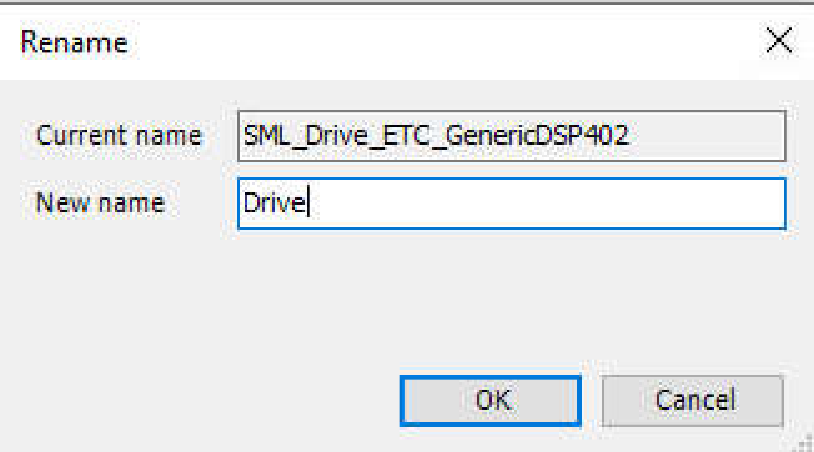
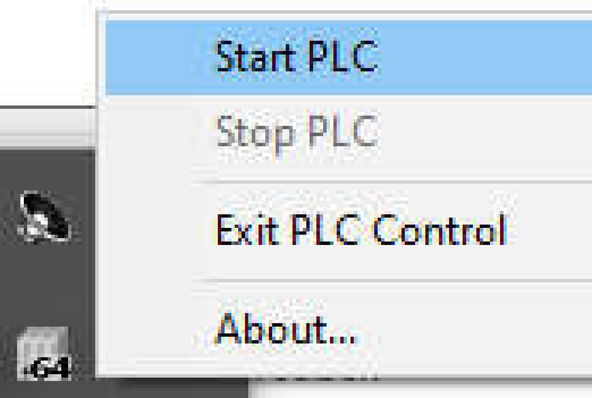
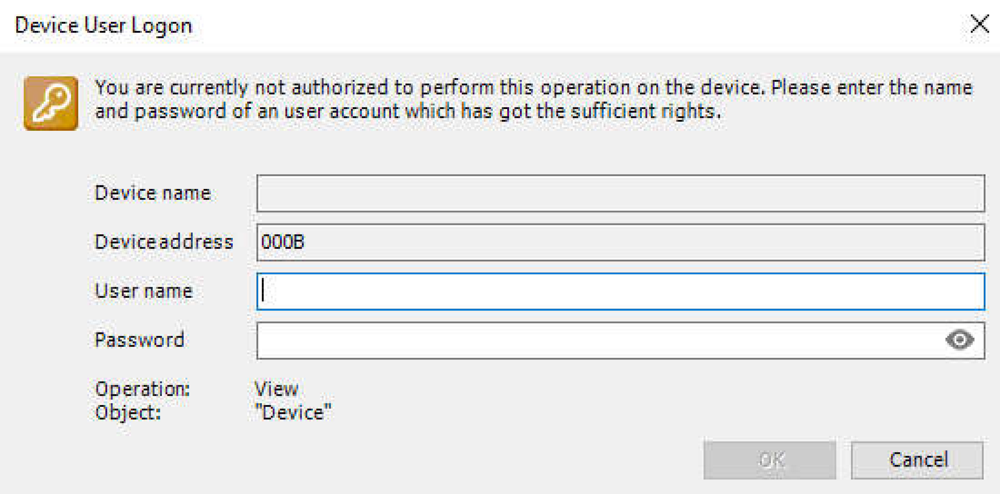
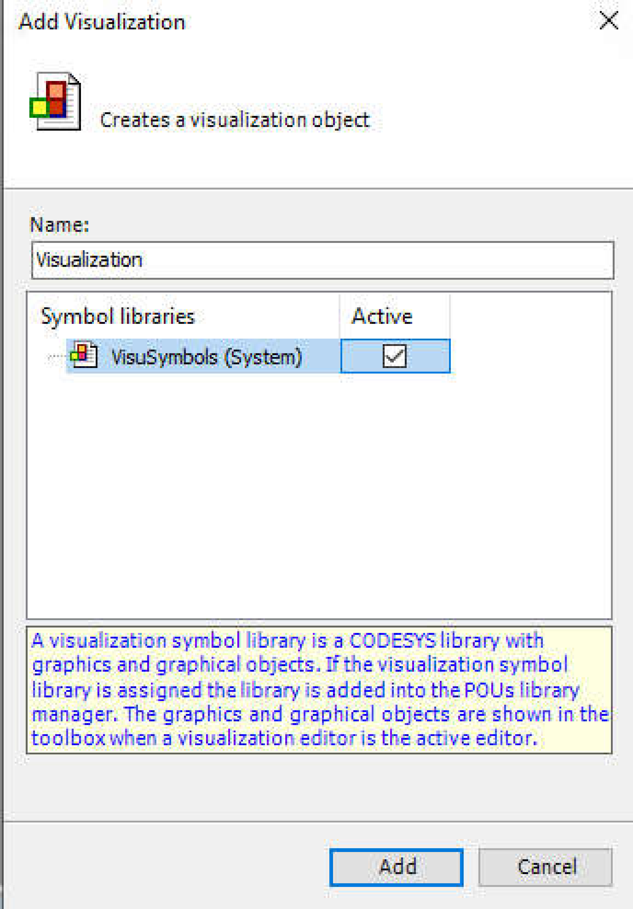

##Polohový (PP) a rychlostní (PV) režim
Servopohon TGZ podporuje další režimy polohování - profilovou polohu a profilovou rychlost.
V takovém případě využívá svůj interní profil-generátor.
Řídicí jednotka pouze nastaví požadovanou cílovou polohu (nebo rychlost) a servopohon provede všechny potřebné výpočty (zrychlení/zpomalení) pro vytvoření profilu polohy nebo rychlosti.
Komunikace mezi řídicí jednotkou a zařízením nemusí probíhat v reálném čase.
Toto je identické pro sběrnice EtherCAT i CAN.

- Připravte servopohon pomocí servisního programu TGZ_GUI: nastavte registr `D-Mode` na `7`: polohový režim PG.
  Toto nastavení je stejné pro režimy PP a PV.

{: style="width:70%;" }

- V závislosti na použitém typu sběrnice vyberte v položce `UseCANbus` buď `EtherCAT`, nebo `CAN`.

{: style="width:70%;" }

- Pokud byla sběrnice změněna, uložte parametry a restartujte pohon.
- Otevřete vývojový systém CODESYS a vytvořte nový projekt **Standard project**.

{: style="width:50%;" }

- Zařízení Control Win (soft real-time) je vhodné pro režimy PP a PV.

{: style="width:50%;" }

- Přidejte soubor s popisem zařízení TGZ (XML pro EtherCAT, EDS pro CANopen) do úložiště zařízení (pokud tak ještě nebylo učiněno).

{: style="width:50%;" }

- Zvolte **Install** a vyberte správný soubor.

{: style="width:50%;" }

- Pravým tlačítkem myši klikněte na **Device (CODESYS Control Win V3 x64)** a vyberte možnost **Add device**.

{: style="width:50%;" }

- V následujícím dialogu vyberte položku **EtherCAT Master SoftMotion** a klikněte na tlačítko **Add Device**.

{: style="width:50%;" }

- Klikněte na položku **EtherCAT_Master_SoftMotion** ve stromu zařízení a v dialogovém okně **Add device** vyberte EtherCAT slave TGZ-Drives/TGZ/TGZ Drive V5 a přidejte jej do projektu.

{: style="width:50%;" }

- Zavřete dialogové okno **Add device** a ve stromu zařízení projektu vyberte položku **TGZ Drive**.
  Klikněte pravým tlačítkem myši a vyberte položku **Add SoftMotionLight CiA402 Axis**.

{: style="width:40%;" }

- Přejmenujte přidanou osu na **Drive** pomocí kontextové nabídky **Refactoring**.

{: style="width:60%;" }
{: style="width:35%;" }

- Spusťte **Control Win PLC** ze systémové lišty Windows.

{: style="width:20%;" }

- Dvojklikem na položku **Device (CODESYS Control Win V3 x64)** otevřete okno s nastavením komunikace.
  Stisknutím klávesy Enter navažte spojení.

{: style="width:90%;" }

- Přihlaste se k zařízení pomocí uživatelského jména a hesla.

{: style="width:50%;" }

- Po úspěšném přihlášení by měla ikona zařízení svítit zeleně.

{: style="width:50%;" }

- Otevřete okno vlastností EtherCAT_Master_SoftMotion a tlačítkem **Select** vyberte síťovou kartu použitou pro sběrnici EtherCAT.

{: style="width:80%;" }

- Zaškrtněte políčko **Use LRW instead of LWR/LRD**.

{: style="width:50%;" }

- Chcete-li systému pomoci s identifikací zařízení na sběrnici, nastavte správné ID zařízení v poli TGZ_Drive properties. 
  Povolte **Experts settings**, poté vyberte **Configured station alias (ADO 0x0012)** a nastavte **Value** na stejné číslo jako u registru `C-ID` v servisním programu TGZ_GUI (v tomto příkladu 5).
  
{: style="width:70%;" }

  Skupina **Common** v TGZ_GUI
  
 {: style="width:80%;" }

- V okně **TGZ_Drive properties** vyberte kartu **Startup Parameters** a změňte hodnotu objektů SDO `6060 a 6860 z 8 na 1`.

{: style="width:60%;" }

- SoftMotion Lite lze snadno testovat a ovládat pomocí připravené vizualizace s názvem VISU_SML_StartupDrive.
  Chcete-li ji použít, deklarujte v kódu PLC_PRG pomocnou proměnnou typu SML_StartupDrive a pojmenujte ji **sml_visu** a také nastavte ukazatel na stejný objekt. 
  
``` 
PROGRAM PLC_PRG
VAR
	sml_visu: SML_StartupDrive;
	p_sml_visu : POINTER TO SML_StartupDrive := ADR(sml_visu);
END_VAR
p_sml_visu^(Axis := Drive);
```

  {: style="width:50%;" }

  Příkaz `p_sml_visu^(Axis := Drive)` přiřadí proměnné `sml_visu` osy SoftMotion Lite.
  Mohl by být spuštěn pouze jednou, např. v události **StartDone**, ale pro jednoduchost je zde volán periodicky.
  Proměnná `sml_visu` je potřebná v šabloně vizualizace (viz níže).
  
- Vizualizaci do aplikace přidáte kliknutím pravým tlačítkem myši na položku **Application** a výběrem položky **Add Object/Visualization menu item**.

{: style="width:45%;" }

- Ponechte výchozí název **Visualization** a klikněte na tlačítko **Add**.

{: style="width:30%;" }

- V okně **Visualization Toolbox** vyberte položku SML a poté šablonu VISU_SML_StartupDrive.

{: style="width:20%;" }

- Přetáhněte šablonu do okna **Visualization** a v následujícím dialogovém okně přiřaďte **m_Startup** výše vytvořené proměnné sml_visu.

{: style="width:80%;" }

- V případě potřeby můžete změnit velikost šablony v okně

{: style="width:80%;" }

- Přihlaste se a spusťte PLC.
  Nyní si pohrajte s vizualizací.
  Povolte **bDriveStart**, **bRegulatorOn** a poté **Enable**.
  Vyzkoušejte absolutní a relativní pohyby.
  Blok MC_MoveVelocity_SML změní režim pohonu na PV.
  Pohyb kdykoli zastavte pomocí MC_Stop_SML.
  Pro přístup k interním členům funkčního bloku AXIS_REF_SML se používají parametry Read a Write.
  
- Sledujte proměnné `Control word`, `Status word` a `Mode of operation` v rozhraní TGZ_GUI.

!!! warning "Warning"
	Nezapomeňte, že servo bude polohovat, takže buďte opatrní!