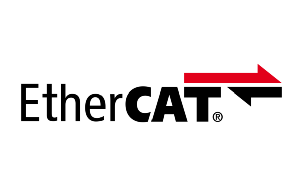

{: style="width:30%;" }
{: style="width:30%;" }   

EtherCAT je registrovaná ochranná známka a patentovaná technologie, licencovaná společností Beckhoff Automation GmbH.
CANopen a CiA jsou registrované ochranné známky společnosti CAN in Automation.

Tento návod popisuje nastavení pohonu TGZ v síti EtherCAT nebo CANopen. Pohony TGZ musí být naprogramovány příslušným firmwarem.
Před použitím pohonu v prostředí EtherCAT nebo CANopen je nutné se důkladně seznámit s [uživatelským manuálem HW TGZ](../../../../CZ/TGZ/TGZ-D-48-13/md/mark.md).

Pro programování TGZ je nezbytná znalost následujících dokumentů:

- Aplikační vrstva CANopen a komunikační profil (CiA 301)
- Profil zařízení Pohony a řízení pohybu (CiA 402)
- Prováděcí směrnice pro profil pohonu CiA402 (ETG.6010)
- EtherCAT Slave Controller - Technologie
- EtherCAT Slave Controller - popis registru

Servopohon TGZ lze ovládat pomocí několika sběrnic a protokolů.
Tato příručka popisuje řízení servopohonu pomocí sběrnice CAN s využitím standardu CANopen a také pomocí ethernetového připojení s využitím standardu EtherCAT s aplikačním protokolem CAN over EtherCAT (CoE).
Je implementován standardní profil pohonu CiA DSP402.

!!! note "Poznámka"
	Technické změny, které vylepšují vlastnosti zařízení, mohou být provedeny bez předchozího upozornění!