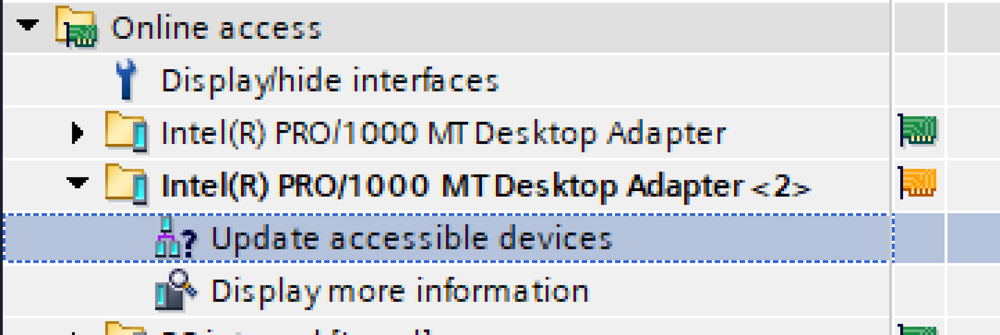
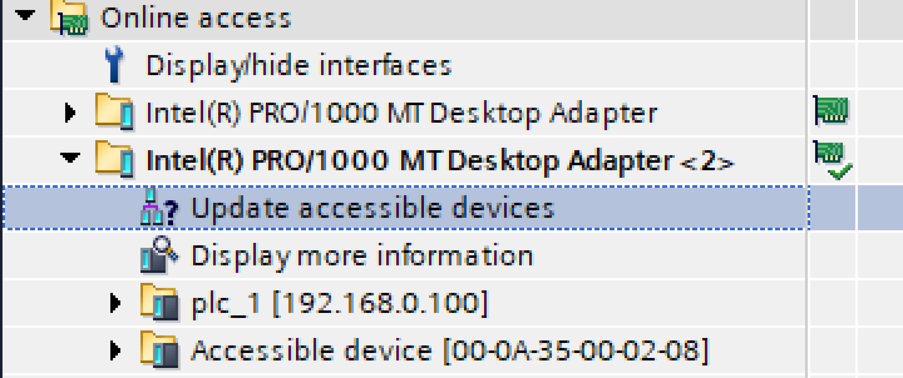
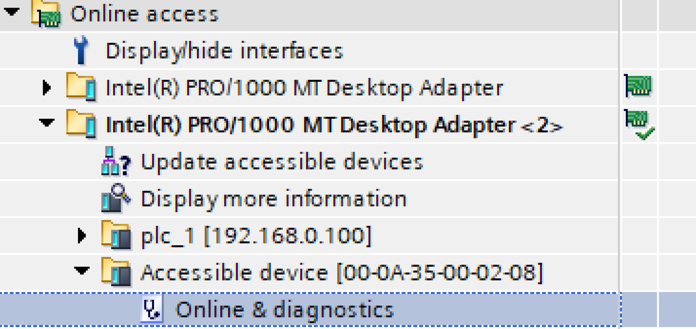
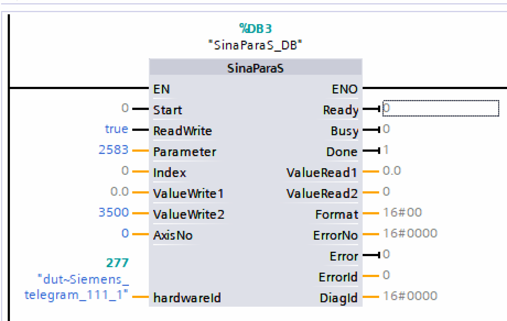

##Obecné
Síť PROFINET se připojuje pomocí konektoru X13 (Fieldbus IN) a konektoru X12 (Fieldbus OUT).
Konektor IN použijte směrem k PLC a konektor OUT k připojení dalších zařízení PROFINET v řetězci.
Servozesilovač TGZ má vestavěnou funkci PROFINET Bridge, takže pro malý počet zařízení a jednoduchou konfiguraci není potřeba speciální řízený PROFINET switch.
**Při připojování síťových kabelů PROFINET musí být vypnuto napájení zařízení**.   

!!! warning "Varování"
	Nastavení servozesilovače TGZ smí provádět pouze odborný pracovník s dostatečnými znalostmi techniky pohonů.
	Veškerá elektrická zapojení musí být provedena v souladu s [uživatelským manuálem HW TGZ](../../../../CZ/TGZ/TGZ-D-48-13/md/mark.md).
	
##Rychlý průvodce nastavením
- Zkontrolujte instalaci a montáž. Dodržujte všechny bezpečnostní pokyny uvedené v návodu k použití.
- Připojte počítač ke konektoru služby X11 Ethernet a spusťte program TGZ GUI.
- Nastavení adresy MAC zařízení:

{: style="width: 90%;" }

- Adresa MAC začíná číslem `00` a `0A`.
  Poslední čtyři čísla mohou být libovolná, ale v síti PROFINET jedinečná.
  Kromě toho se poslední číslo musí lišit o 8, takže platné hodnoty pro poslední číslo jsou `00, 08, 10, 18, 20, 28, ..., 90, 98, A0, A8, B0, B8, ..., F0, F8`.
- Základní hodnota adresy MAC se používá pro servisní port X11.
  MAC adresa rozhraní PROFINET se vypočítá přičtením `4` k základní hodnotě, X13 (IN) má adresu `base + 5` a X12 (OUT) `base + 6`.
  Při uvádění zařízení PROFINET do provozu se obvykle používá pouze adresa MAC rozhraní PROFINET.
  První dvě hexadecimální čísla jsou vždy `00` a `0A` pro všechna rozhraní PROFINET a konektory X13 a X12 bez ohledu na hodnotu zadanou v grafickém rozhraní TGZ.
- Zvolte správné číslo telegramu podle projektu PROFINET a typu mechanismu ovládaného servopohonem TGZ.

{: style="width: 90%;" }

- V případě dvouosé varianty servozesilovače nastavte typ telegramu pro obě osy.
- Uložte parametry do jednotky.

{: style="width: 40%;" }

- Restartujte jednotku.

{: style="width: 40%;" }

!!! note "Poznámka"
	Při změně adresy MAC a/nebo čísla telegramu je důležité vždy uložit parametry a restartovat servozesilovač.
	
##Název a IP adresa zařízení {#ProfinetIPsettings}
IP adresa je z výroby nastavena na `0.0.0.0` a název zařízení je prázdný.
V síti PROFINET je třeba přiřadit jedinečný název zařízení a IP adresu.
K tomu lze použít libovolný software PROFINET, například **TIA Portal**.

- Vyberte síťový adaptér PC, který je připojen k síti PROFINET, a dvakrát klikněte na řádek **Update accessible devices**.

{: style="width: 40%;" }

- Připojená zařízení se po chvíli objeví:

{: style="width: 40%;" }

- Měl by se zobrazit seznam všech připojených zařízení v síti PROFINET.
  Rozbalte zařízení s danou MAC adresou a dvojklikem zvolte **Online & diagnostics**.
  
{: style="width: 40%;" }

- Zadejte jedinečnou IP adresu a vhodnou masku podsítě (obvykle `255.255.255.0`) a klikněte na tlačítko **Assign IP address**.

{: style="width: 70%;" }

- Nastavte název zařízení, který musí být v síti PROFINET také jedinečný, a přiřaďte jej tlačítkem **Assign name**.

{: style="width: 70%;" }

- Volitelně lze k lokalizaci zařízení v terénu použít blikání kontrolky LED zaškrtávacího políčka.
  TGZ bliká písmeny "Pd" na svém segmentovém LED displeji (Pd znamená PROFIdrive).
  
##Režimy polohování
Pohon musí být v provozním stavu s nastaveným režimem polohování (telegramy `7`, `9` nebo `111`).
Nesmí být aktivní žádná úloha a pohon musí být v klidovém stavu.
Režim se volí parametrem `Homing_Mode` v aplikaci TGZ_GUI.
Chcete-li zahájit polohování, nastavte řídicí slovo `STW1` bit `11` na jedničku.
Když probíhá procedura polohování, stavové slovo `ZSW1` bity `10, 11 a 13` se nastaví na nulu.
Po úspěšném navádění se tyto bity `10, 11 a 13` nastaví na jedničku.
V případě jakékoli chyby během polohování se nastaví pouze bit `13`.
Postup navádění lze přerušit nastavením bitu `11 STW1` na nulu.
Úspěšný postup navádění je rovněž nutné ukončit nastavením bitu `11 STW1` na nulu.
Teprve poté se pohon vrátí do základního provozního stavu.

K dispozici jsou následující režimy polohování:

| č. režimu | popis režimu |
|-----|-------|
| 0   | Nastavení nuly na skutečnou polohu. Používá skutečnou polohu jako referenci výchozího bodu. |
| 1   | Vyhledání mezního vstupu. Pohyb se spustí do kladného nebo záporného směru, dokud není detekován koncový spínač. Poté se použije zpětný pohyb, dokud koncový spínač není aktivní. Jako výchozí bod se použije aktuální poloha. Parametry `Homing_NegLimSwitchMask` a `Homing_PosLimitSwitchMask` se používají k výběru bitu digitálního vstupu koncového spínače. Znaménko parametru `Homing_Velocity_Direction` určuje směr polohování. |
| 2   | Najdi mezní vstup a poté nulový úhel. Podobně jako v režimu 1, ale po nastavení výchozí polohy se motor přesune do nulového úhlu zpětné vazby. |
| 4   | Najdi základní vstup. Tento režim je podobný režimu 1, ale jako vstup používá naváděcí spínač (parametr `Homing_ReferenceSwitchMask`). Počáteční směr je určen znaménkem parametru `Homing_Velocity_Direction`. V algoritmu se zohledňují také kladné a záporné přepínače. |
| 5   | Najdi základní vstup a pak nulový úhel. Podobně jako v režimu 4, po nastavení výchozí polohy pohon přejde na nulový úhel zpětné vazby. |
| 8   | Přesun na mechanický doraz. Pohon se pohybuje, dokud nenarazí na tvrdý doraz, což způsobí překročení chyby polohy. Poté se pohyb zastaví a nastaví se výchozí poloha. |
| 9   | Přesun na mechanickou zarážku a poté nastav nulový úhel. Podobně jako v režimu 8 se motor po nastavení výchozí polohy přesune do nulového úhlu zpětné vazby. |

##Tasks
Zesilovač TGZ umožňuje používat až deset úloh v režimu polohování.
Čísla úloh se nastavují signálem `SATZANW` v telegramu` 7, 9 nebo 111`.
Parametry úlohy lze nastavit pomocí rozhraní TGZ_GUI.
Cílová poloha je vždy 64bitová (v jednotkách TGZ), aby byla umožněna plná přesnost hodnoty.
Režim úlohy je buď 0 - relativní polohování, nebo 1 - absolutní cílová hodnota.
Pro neplatné číslo úlohy se neprovede žádná akce.
Platné hodnoty jsou 0 - 9 `(PD_Task1 - PD_Task10`).
Podrobný popis úlohy a přímého režimu **Manual data input (MDI)** naleznete v dokumentaci k **PROFIdrive Profile** .

##Jog
Funkce jog je podporována jak v polohovém (telegramy `7, 9, 111`), tak v rychlostním režimu (telegramy `1, 3, 352`).
Všechny parametry funkce jog lze nastavit pomocí aplikace TGZ_GUI.
Pomocí řídicího slova `STW1 bitů 8 a 9` jsou k dispozici dvě nastavené hodnoty jog.
Pokud jsou nastaveny oba bity, pohon se buď zastaví v režimu rychlosti, nebo v režimu polohování nedělá nic.   

Pohon pracuje v rychlostním režimu, když je jog aktivní, tj. pohybuje osou požadovanou rychlostí jog nekonečně dlouho, dokud se nezastaví.   

Funkce je implementována podle standardu popsaného v dokumentaci PROFIdrive Profile.

##Chybové kódy
V případě jakékoli chyby pohonu se chybový kód zkopíruje do vyrovnávací paměti chyb.
Používá se standardní mechanismus vyrovnávací paměti chyb PROFIdrive.
Protože standardní chybový kód PROFIdrive má šířku pouze 16 bitů a TGZ používá 32bitové chyby, existují vždy dvě chybové zprávy obsahující celé 32bitové chybové slovo.
Proto je parametr `947` organizován s 8 chybovými situacemi se 2 chybovými zprávami.
Zpráva s indexem `0` obsahuje dolních 16 bitů chybového kódu a zpráva s indexem `1` horních 16 bitů.
Vyrovnávací paměť poruch lze zcela vymazat zápisem nuly do parametru `952`.   

Telegram `111` obsahuje prostor pro poslední aktivní chybový kód, přičemž pole `WARN code (PZD11)` obsahuje dolních 16 bitů a pole `FAULT code (PZD10)` obsahuje horních 16 bitů chybového kódu TGZ.
Podobně má telegram `352` pole pro `WARN (PZD5) a FAULT (PZD6)`. Jsou kódovány stejným způsobem.
Chybové kódy TGZ jsou bitově orientované, tj. je možných až 32 chyb, a jsou kumulativní, tj. může být nastaveno několik bitů současně.

| Bit | Popis |
|-----|-------|
| 0   | Síťová fáze (1-fázové napájení) |
| 1   | Porucha síťového napájení |
| 2   | reserved (interní chyba) |
| 3   | Přepětí DC-Link |
| 4   | Podpětí DC-link |
| 5   | vyhrazeno |
| 6   | Chyba brzdy při držení |
| 7   | Poškozený spínač přídržné brzdy |
| 8   | vyhrazeno |
| 9   | Termostat motoru |
| 10  | Okolní teplota |
| 11  | Teplota chladiče |
| 12  | Chyba zpětné vazby |
| 13  | Chyba komutace |
| 14  | Překročení rychlosti |
| 15  | Chyba při konturování |
| 16  | Chyba trajektorie (nastavená hodnota polohy) |
| 17  | Chyba komunikace s hostitelem |
| 18  | Chybová rampa pohonu E2 |
| 19  | Chyba pohonu Bez náběhu E1 |
| 20  | Chyba externí aktivace/blokování/blokování brzdy |
| 21  | Chyba napětí ovladače IGBT |
| 22  | Chyba maximálního výkonu regenerace |
| 23  | Chyba napájení brzdy 24 V |
| 24  | vyhrazeno |
| 25  | Chyba I2T |
| 26  | Upozornění na teplotu motoru |
| 27  | Chyba parametru motoru |
| 28  | Chyba víceotáčkové otáčky |
| 29  | Max. Omezení součtového výkonu |
| 30  | vyhrazeno |
| 31  | vyhrazeno |

##Vztah mezi souřadnicemi TGZ a hodnotami PROFIdrive
Jednotka TGZ používá pro polohu 64bitové hodnoty.
Tato hodnota se skládá z počtu otáček v horních 32 bitech a počtu přírůstků v rámci jedné otáčky.
Naproti tomu standard PROFIdrive používá pro polohu pouze 32bitové hodnoty.
Z tohoto důvodu je nutný určitý druh škálování.
Hledaná hodnota polohy z telegramu PROFIdrive je rozšířena na 64 bitů a poté posunuta doleva o 32 minus počet bitů uvedený v nastavení TGZ - hodnota `BitsPerRevol` generátoru profilu (PG).
Pokud je například `BitsPerRevol=20`, pak je hodnota z PROFIdrive posunuta doleva o 12 bitů.
Posunutí má stejný účinek jako vynásobení hodnoty 212 (tj. 4096).
Podobné snížení se provádí při odesílání aktuální hodnoty polohy z TGZ do řídicí jednotky PROFIdrive: 64bitová poloha TGZ se posune doprava o 32 - `BitsPerRevol` (což je stejná operace jako dělení 2(32-B itsPerRevol) ) a výsledných dolních 32 bitů se odešle v telegramu PROFIdrive.   

Hodnoty rychlosti nejsou vůbec škálovány, protože telegramy TGZ i PROFIdrive používají 32bitové hodnoty.
Význam rychlosti je proto stejný jako význam rychlosti pro profil generátor.  

Akcelerace a decelerace musí být nastaveny přímo v TGZ servisním programem TGZ_GUI v sekci PROFIdrive a můžou být změněny telegramy PROFIdrive pouze pomocí přepisovacích (procentuálních) hodnot obsažených v příslušných telegramech.

##Kompenzace vůle
Firmware ze srpna 2023 nebo novější implementuje kompenzaci vůle.
Pro hodnotu vůle se používá standardní parametr `PNU 2583`.
Je uložen jako celočíselná 32bitová hodnota se znaménkem a má stejný fyzikální význam jako požadovaná nebo skutečná poloha v telegramu `9` nebo `111`.   

Chcete-li použít kompenzaci vůle, je třeba nejprve provést úspěšný postup polohování.   

**Kladný** směr pohybu se provádí při inkrementaci skutečné polohy.
Stejně tak je definován **záporný** směr pohybu, když je pozice dekrementována.   

Samotná kompenzace závisí na znaménku vůle:

- Kladná hodnota vůle: pokud je požadovaná poloha v kladném směru, je k hodnotě přičtena hodnota vůle.
  Naopak při záporném pohybu se k požadované poloze nepřičítá žádná hodnota.
- Záporná hodnota vůle: při záporném pohybu se vůle odečítá od požadované polohy, takže výsledek je zápornější.
  Při kladném směru se ke konečné požadované poloze nepřičítá žádná hodnota.
  
Použití kladné nebo záporné vůle závisí na zvoleném postupu polohování a jeho konečném pohybu.
Pokud polohování končí záporným pohybem, použijte kladnou vůli, protože vůle je již nastavena na levou stranu.
Stejně tak zvolte zápornou hodnotu vůle, pokud poslední naváděcí pohyb probíhá v kladném směru.   

Hodnotu vůle lze nastavit pouze pomocí parametru `PNU 2583` v PLC, v oblasti registru TGZ není žádný ekvivalent.   

Pro nastavení `PNU 2583` lze v portálu TIA použít programový blok s názvem **SinParaS**.

{: style="width: 50%;" }

Vstup `hardwareId je` nastaven na stejnou hodnotu jako vstup `HWIDSTW` bloku SinaPos, tj. identifikátor telegramu TGZ.
AxisNo může být 0 pro první osu nebo 1 pro druhou osu.
Protože je vůle typu DINT (celé číslo se znaménkem 32bit), musí být požadovaná hodnota vůle zapsána na vstup `ValueWrite2`.
Zápis se provede přepnutím Start z False na True.

##Režim regulace otáček a normalizované hodnoty
Telegramy `1, 3 a 352` se používají pro režim regulace otáček.
Tyto telegramy používají normalizované hodnoty otáček ve formátu N2 nebo N4 (kapitola 6.3.4.5 příručky PROFIdrive).
Požadované a skutečné otáčky jsou vyjádřeny v procentech referenční hodnoty.
Servozesilovač TGZ k tomuto účelu používá registr jmenovitých otáček s názvem `M-Nn` - ten musí být nenulový, jinak by režim regulace otáček nefungoval.
Normalizované hodnoty N2 nebo N4 v telegramu jsou v rozsahu od -200 % do 200 % referenční hodnoty `M-Nn`.
Registr `M-Nn` lze číst pomocí standardního parametru `PNU 60 000` **Velocity reference value**.
Kompletní přístup (čtení/zápis) je možný přímým přístupem k parametrům TGZ, čísla registrů jsou `0x211B` pro osu 1 a `0x221B` pro osu 2.
Viz. také Registry TGZ.

!!! note "Poznámka"
	Všimněte si, že `PNU 60 000` se čte jako plovoucí hodnota, zatímco přímý přístup k registrům TGZ je vždy 32bitovým celým číslem.

Interní generátor rychlostního profilu používá při změně rychlosti jako hodnotu zrychlení registr `PD_Dec (0x355F / 0x365F)`.