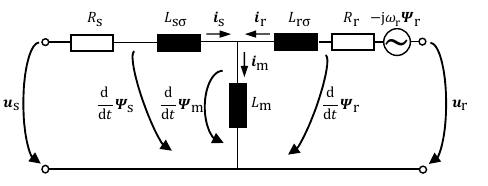

##Asynchronous motor (ASM)
###ASM control in scalar mode (no feedback)
| Parameter | Description |
|---|---|
| D-Mode | 20 = U/f control mode |
| M-Inull | nominal current, i²t is calculated for each phase, if exceeded it falls to error |
| M-polepairs | number of motor poles |
| M-CommutationSource | 10 = ASM mode |
| M-Un | ASM nominal voltage |
| IM-fn | nominal/synchronous frequency |
| IM-Umin_u_f | minimum control voltage U/f , to increase torque at low speed |
| IM-Umax_u_f | maximum voltage at U/f control, to limit motor power. The peak voltage is equal to the DCbus voltage only the effective value is limited. |

Asynchronous motor control is enabled via PG as in synchronous motor modes.
However, no position or speed control is used here.
The PG output in this case is a synchronous frequency.

###Vector control (with Hiperface DSL sensor)
{: style="width:50%;" }

| Parameter | Description |
|---|---|
| M-CommutationSource | 10 = ASM mode |
| IM-Rs | stator resistance |
| IM-Ls | Stator Inductance = Lsσ + Lm |
| IM-Rr | Rotor Resistance |
| IM-Lr | Rotor inductance = Lrσ + Lm |
| IM-Lm | Magnetizing inductance |
| IM-Id_rms | nominal excitation current Id (rms value) |

Motor control is possible in all modes as with a synchronous motor.

##Gear
This functionality allows the implementation of an electronic transmission and an electronic cam.

!!! Note "Note"
	The electronic cam is in continuous development and has not been implemented yet.
	 
Electronic transmission via input position and gear ratio and determines the position of the motor.
Replaces less efficient mechanical gearboxes.

| Parameter          | Unit             | Read/write    | Description                                                                                     |
|--------------------|------------------|---------------|-------------------------------------------------------------------------------------------------|
| PositionAngle      | [inc]            | read / write  | Output position within one revolution for linear transmission or pointer to CAM for cam transmissions |
| PositionRevol      | [inc]            | read / write  | Multi-speed output position for linear gear or CAM pointer for cam gears                         |
| CamPositionAngle   | [inc]            | read / write  | Output position within one revolution for cam gears                                              |
| CamPositionRevol   | [inc]            | read / write  | Multi-speed output position for cam gears                                                        |
| OffsetAngle        | [inc]            | read / write  | Output position offset                                                                         |
| OffsetRevol        | [inc]            | read / write  | Output position offset                                                                         |
| Shift              | [inc]            | read / write  | Required movement of the pointer on the cam                                                     |
| ActualShiftAngle   | [inc]            | read          | Actual pointer movement on the cam                                                              |
| IncShift           | [inc/servotick] | read / write  | Increment of the shift indicator on the cam                                                     |
| IncIn              | [inc/servotick] | read / write  | Gear.ActualIn ramp increment                                                                   |
| CamIncPosition     | [inc]            | read          | Incremental cam position increment                                                             |
| CamScale           | [-]              | read / write  | Cam profile scaling factor                                                                     |
| SourceNumber       | [-]              | read          | The number of the logical servo used for the main positioning source                            |
| SourcePosition     | [-]              | read          | Main position type 1 = Write position, 2 = Position, 3 = servotick, 4 = Exposure               |
| Mode               | [-]              | read / write  | Gear generator modes 0 = gear generator off, 1 = linear gear active, 2 = cam gear active       |
| In                 | [-]              | read / write  | Gear ratio numerator                                                                           |
| Out                | [-]              | read / write  | Gear ratio denominator                                                                         |
| ActualIn           | [-]              | read / write  | Actual value of the numerator gear ratio                                                        |
| CamLine            | [-]              | read / write  | Offset in bytes to the first cam profile data in CAM_PROFILE_MEMORY or DATA_MEMORY             |
| CamLen             | [-]              | read / write  | Cam profile data number                                                                        |
| CamType            | [-]              | read / write  | Cam type 0 = rotating cam, 1 = front cam                                                        |
| CamTab             | [-]              | read / write  | Location of cam profile data: 0 = to flash memory, 1 = to SD card                               |
