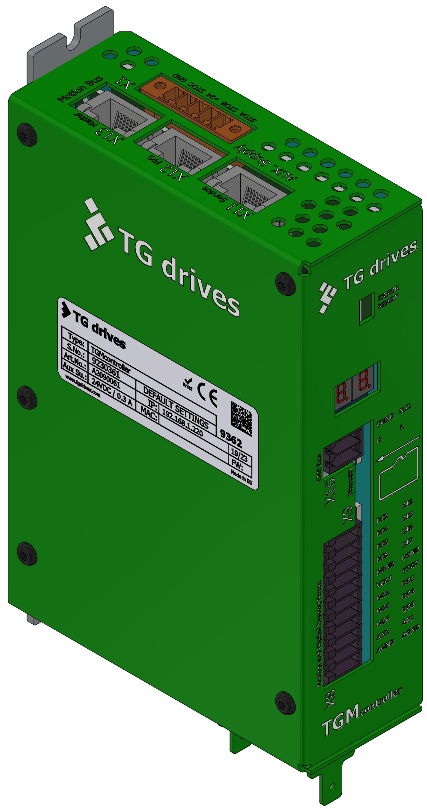

{: style="width:35%;" }

S vývojem softwaru a operačních systémů je stále obtížnější spouštět na počítačích procesy pracující s reálným časem.
Na druhou stranu komunikační rychlosti jsou při použití standardního gigabitového připojení Ethernet více než dostatečné.
Externí zařízení s výkonným procesorem reálného času a rychlým připojením může snadno nahradit obtížně udržovatelné softwarové rozšíření operačního systému.
Zařízení **TGMcontroller** dokonale splňuje výše uvedené požadavky a vlastnosti.

##Vlastnosti
**TGMcontroller** je kompletní řídicí systém s platformou **TGMotion** - verze 502 nebo vyšší.
Pracuje jako EtherCAT master a prostřednictvím sběrnice podporuje až:

- 64 os
- 16 jednotek I/O 
- 16 dalších uživatelsky definovaných zařízení
- 3 nezávislé CNC interpolátory, každý s 10 osami.
	
Paměť osciloskopu má velikost 32&nbsp;MB, což umožňuje ukládat informace o velmi rozsáhlém procesu. 
Programy virtuálního PLC se programují v jazyce C nebo C++, k dispozici je kompletní řetězec nástrojů GNU.
Vývoj PLC lze provádět v libovolném IDE systému, např. ve Visual Studio nebo VS Code.   
Minimální doba cyklu je 100&nbsp;µs.   
EtherCAT master má extrémně nízký jitter v řádu několika nanosekund.
To znamená, že pakety EtherCAT jsou po sběrnici odesílány ve velmi přesných intervalech a umožňují řídit proces s velmi vysokou kvalitou.   
K dispozici je kompletní sada komunikačních a diagnostických nástrojů - Windows a částečně Linux.   
Řídicí systém TGMotion je popsán ve vlastní příručce.

##Hardware
Systém je založen na osvědčeném a výkonném SoC FPGA Zynq + dvoujádrovém procesoru Cortex A9 s frekvencí 667&nbsp;MHz.
Zařízení disponuje 128&nbsp;MB paměti RAM a 16&nbsp;MB paměti flash (používá se pro zlatou bezpečnostní verzi firmwaru).
Vlastní firmware, konfigurace a uživatelem definované PLC jsou uloženy na kartě SD o velikosti 8&nbsp;GB.
Komunikace s ostatními zařízeními může probíhat prostřednictvím 3&nbsp;ethernetových portů a/nebo sběrnice CAN.
Systém má 8&nbsp;digitálních vstupů, 6&nbsp;digitálních výstupů a 2&nbsp;analogové vstupy.
K dispozici jsou také 3&nbsp;zpětné vazby.
Podporovaná digitální rozhraní jsou Hiperface DSL, EnDAT 2.2, SSI a inkrementální snímač IRC.
