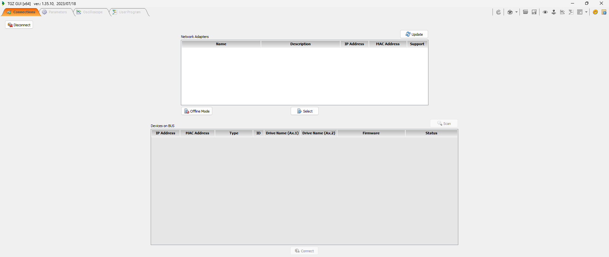

##Obtaining software
The control and service software of the **TGZ GUI** application is used to set the servo amplifier.
At the same time, it is possible to monitor the parameters of the TGZ servo amplifier.
The **TGZ GUI** can be downloaded from the [TG Drives website](https://www.tgdrives.cz/fileadmin/user_upload/download-TGZ/TGZ_GUI.zip).

##Installation and startup {#GUIstart}
**Installing TGZ GUI:**   
The TGZ GUI control software does not require special installation, you only need to copy the program to disk, but it is necessary to keep the subdirectory structure.    

**Starting the program:**   
To start the TGZ GUI, double-click on the `TGZ_GUI.exe` icon.
The launched application window then looks like this:
{: style="width:100%;" }

The running window of the TGZ GUI control software has three basic tabs - **Connections**, **Parameters** and **Oscilloscope**, which are always activated by clicking on the appropriate tab.
In the upper right part of the window there are a total of 11 program icons  

{: style="width:40%;" }

, whose functions are described below: 

-   **REFRESH PARAMETERS**

    ---
	{: style="width:10%;" }

-	reload stored parameters (eg from a memory card).

-   **DEVICE MEMORY**

    ---
	{: style="width:10%;" }

-   allows saving and reading parameters from the memory card, default settings, servo amplifier restart and firmware playback.

-   **LOAD PARAMETERS FROM FILE**

    ---
	{: style="width:10%;" }

-	load parameters from a file.

-   **SAVE PARAMETERS TO FILE**

    ---
	{: style="width:10%;" }

-	save parameters to a file.

-   **MONITORING**

    ---
	{: style="width:10%;" }

-	call up / hide the menu in the right part (basic information about individual axes of the servo amplifier and monitoring of current values of selected parameters).

-   **SERVICE MOTION**

    ---
	{: style="width:10%;" }

-	enables test control of the servomotor in different modes directly from the TGZ GUI

-   **OSCILLOSCOPE**

    ---
	{: style="width:10%;" }

-	activates the `Oscilloscope` tab as a separate window.

-   **USER PROGRAM**

    ---
	{: style="width:10%;" }

-	Activates the *External User Program* tab as a separate window. Here you can run any user test program.

-   **LAYOUT**

    ---
	{: style="width:10%;" }

-	allows user to load/save the layout of TGZ GUI panels and windows.

-   **CONFIGURATION**

    ---
	{: style="width:10%;" }

-	TGZ GUI settings (communication, type of output data from the oscilloscope, language settings).

-   **SYSTEM MESSAGES**

    ---
	{: style="width:10%;" }

-	displays a list of application system messages.

