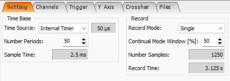
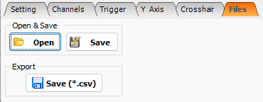

In the **Oscilloscope** tab, it is possible to record the waveforms of selected parameters of the TGZ servo amplifier as a function of time.
The oscilloscope working window is shown below:

{: style="width:100%;" }

At the bottom of the window there are other tabs that are used for more detailed settings.

-   **SETTING**

    ---
	{: style="width:85%;" }

-	used to set the time axis (number of recording periods, type of recording - one-time, continuous, etc.)

-   **CHANNELS**

    ---
	{: style="width:85%;" }

-	selection of parameters for recording on the oscilloscope (for quantities it allows to select units separately for right and left Y axis, set scale, color and thickness of the graph, visibility, etc.)

-   **TRIGGER**

    ---
	{: style="width:85%;" }

-	allows setting the start of recording of the graphic course of the selected quantity at the desired moment by setting the expected value (VALUE) and the ratio of the time interval before starting the recording (PRETRIGGER) in %

-   **Y AXIS**

    ---
	{: style="width:85%;" }

-	setting of parameters of right and left Y axis (axis descriptions, value ranges, type)

-   **CROSSHAIR**

    ---
	{: style="width:85%;" }

-	accesses the function of measuring values directly in the graph, including various types of calculations (e.g. effective value of a given quantity and others)

-   **FILES**

    ---
	{: style="width:85%;" }

-	allows import and export of data

-   **CONTROL**

    ---
	{: style="width:50%;" }

-	ontrol of recording, press RECORD to start recording, press STOP to stop recording

-   **ZOOM**

    ---
	{: style="width:50%;" }

-	option to set the display size

