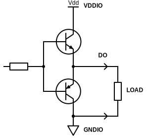

##Základní popis {#commonDO1-6}
Servozesilovač TGZ má ve standardním provedení (UNI) na konektoru **X8** integrováno šest rychlých izolovaných digitálních výstupů typu push-pull (totem pole).
Výstupy ke své funkci potřebují napájení přivedné na VDDIO na konektoru **X8** (značeno také "VCC DO").
Napájení je rozděleno na dvě skupiny.
Výstupy DO1,3,5 jsou napájeny z napájecího vstupu VCC DO1,3,5 (pin 12 konektoru X8).
Výstupy DO2,4,6 jsou napájeny z napájecího vstupu VCC DO2,4,6 (pin 11 konektoru X8).   

Zjednodušené schéma zapojení digitálních výstupů viz. obrázek:
{: style="width:80%;" }

Jelikož se jedná o výstupy typu push-pull je v každém okamžiku definován výstupní stav jako log. 0 (DO připojeno ke GNDIO) nebo log. 1 (DO připojeno k VDDIO). Výstupy nejsou nikdy plovoucí.

!!! warning "Varování"
	Nikdy na výstupy DO přímo nepřipojujte napájecí napětí, ani jeho záporný pól.
	Mohlo by dojít k poškození výstupu.

##Ochrany
Digitální výstupy jsou chráněny proti přetížení a zkratu na výstupu pomocí společné inteligentní pojistky v napájecím obvodu VDDIO. Tato ochrana je společná vždy pro jednu skupinu výstupů (osa 1, osa 2).
Dojde-li např. k přetížení DO2, inteligentní ochrana odpojí napájení celé skupině výstupů, tedy DO4 a DO6.
DO1, 3 a 5 budou v tomto případě pracovat bez přerušení.   

##Typické zapojení
Typické schéma připojení zátěže k DO je nejčastěji *horní spínač*.   

{: style="width:30%;" }   

Zátěž je připojena mezi DO a GNDIO. Povelem pro DO `sepni` (log. 1) se na zátěži objeví napájecí napětí VDDIO.
Povelem `vypni` (log. 0) se na zátěži objeví GNDIO.

Opačným případem je připojení zátěže k DO jako *dolní spínač*.   

{: style="width:30%;" }   

Zátěž je připojena mezi VDDIO a DO. Povelem pro DO `sepni` (log. 1) se na zátěži objeví na obou koncích napájecí napětí VDDIO, tj. zátěží neteče proud.
Povelem `vypni` (log. 0) se na zátěži objeví VDDIO proti GNDIO a zátěž je sepnuta - teče proud.   

##Induktivní zátěž
Při spínání induktivních zátěží větších výkonů (typicky cívky relé, stykačů, ventilů apod.) je nutné použít externí ochrannou diodu D1 (anti-kickback) vhodně proudově a napěťově dimenzovanou.
Doporučujeme použít usměrňovací nebo schottky diodu zapojenou dle schématu:   

{: style="width:35%;" }
{: style="width:35%;" }

!!! note "Anti-kickback"
	Při spínání induktivních zátěží docházi k vygenerování napěťového překmitu na vypínané indukčnosti.
	Velikost překmitu je závislá na indukčnosti smyčky (cívka + kabeláž) a proudu sepnuté zátěže.
	Při spínání malých induktivních zátěží s odběrem menším než cca. 100mA (miniaturní relé apod.) není potřeba implementovat externí ochrannou diodu D1.

##Parametry

--8<-- "CZ/md/X8_commonHW_DO_tab.md"