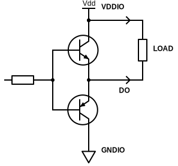
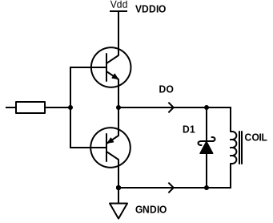

##Basic Description {#commonDO1-6}
The TGZ servoamplifier has six fast isolated push-pull (totem pole) digital outputs integrated on the **X8** connector in the standard (UNI) design.
The outputs require a power supply applied to the VDDIO on the **X8** connector (also labeled "VCC DO") to function.
The power supply is divided into two groups.
The DO1,3,5 outputs are powered from the VCC DO1,3,5 power input (pin 12 of connector X8).
The DO2,4,6 outputs are powered from the VCC DO2,4,6 power input (pin 11 of connector X8).   

For a simplified wiring diagram of the digital outputs, see the figure:
{: style="width:80%;" }

Since these are push-pull outputs, the output state is defined at all times and there is no high-Z option.
Logic 0 (DO connected to GNDIO) or logic 1 (DO connected to VDDIO).
The outputs are never floating.

!!! warning "Warning"
	Never connect the supply voltage directly to the DO outputs or its negative pole.
	High risk of damage of the DO circuitry

##Protection
The digital outputs are protected against overload and output short circuit by a common smart fuse IC in the VDDIO power supply circuit.
This protection is common to one group of outputs (axis 1, axis 2) at a time.
If, for example, DO2 is overloaded, the intelligent protection disconnects the power supply to the entire output group, i.e. DO2, DO4 and DO6.
In this case, DO1, DO3 and DO5 will operate without any interruption.

##Typical wiring
The typical connection diagram of the load to the DO is most often *high side switch*. 

{: style="width:30%;" }   

The load is connected between the DO and GNDIO. The DO `ON` command (log 1) causes the supply voltage VDDIO to appear on the load.
The command `OFF` (log 0) causes GNDIO to appear on the load.

The opposite case is to connect the load to the DO as a *low side switch*.   

{: style="width:30%;" }   

The load is connected between VDDIO and DO. The DO command `ON` (log 1) causes the VDDIO supply voltage to appear at both ends of the load, i.e. no current flows through the load. The load is not energized.
With the command `OFF` (log 0), VDDIO appears on the load against GNDIO and the load is switched on - current flows and the load is energized.  

##Inductive load
When switching inductive loads of higher power (typically relay coils, contactors, valves, etc.) it is necessary to use an external protection diode D1 (anti-kickback) suitably current and voltage rated.
We recommend using a rectifier or schottky diode connected according to the schematic:   

{: style="width:35%;" }
{: style="width:35%;" }

!!! note "Anti-kickback"
	When switching inductive loads, a voltage surge is generated on the inductance being switched off.
	The magnitude of the surge depends on the inductance of the loop (coil + wiring) and the current of the switched load.
	When switching small inductive loads with a current of less than approx. 100 mA (miniature relays, etc.), there is no need to implement an external protection diode D1.

##Parametry

--8<-- "md/X8_commonHW_DO_tab.en.md"