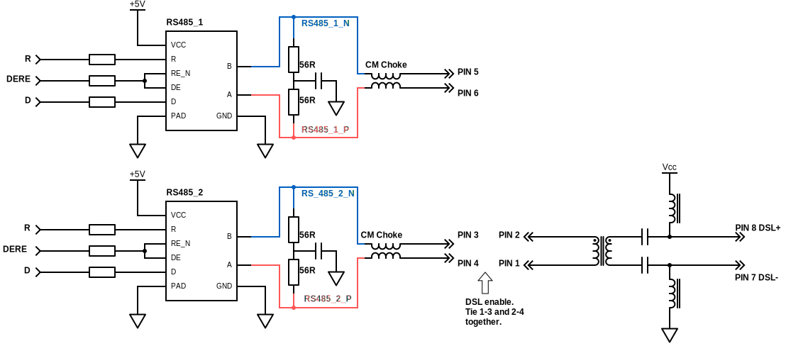
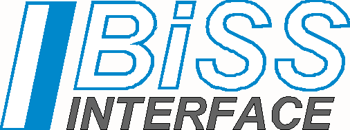

##Basic Description {#commonFB12}
The TGZ servo amplifier includes feedback circuits for axis 1 and axis 2 on the **X6** and **X7** connectors in the standard (UNI) version.
It is possible to connect Endat, SSI, BISS, incremental encoder feedback and, after applying the FBSELx jumper, also Hiperface DSL.   

A simplified internal wiring diagram is shown in the figure below.

{: style="width:80%;" }

These are 2 very fast RS485 bus drivers capable of operating at data rates up to 20 Mbit/s.

!!! note "Cable length"
	The maximum baud rate decreases with the length of the feedback cable.
	To increase the interference immunity of the device, make sure to use the original cable of the appropriate length.
	An unnecessarily long cable (spare loop/cable) may cause a reduction in the device's EMI immunity.

Each RS485 line is internally symmetrically terminated with a 112 Ω resistor.
In addition, there is a common mode choke for greater immunity to the EMI.
The X6 and X7 connector is represented by pins 1-8 in the schematic.   

In case of a Hiperface DSL feedback, pins 1-3 and 2-4 need to be connected together. 
This will connect the RS_485_2 signal to the line power output circuit.
Then just connect a suitable Hiperface DSL position sensor at pins 7-8.

!!! warning "Firmware"
	Make sure that you use the correct firmware for the selected feedback type.
	Contact your supplier for further details.
	
##Supported position sensors
###[Hiperface DSL](https://www.hiperfacedsl.com/index_en.html)
{: style="width:10%;" } is a purely digital protocol requiring a minimal number of wires between the servo drive and the motor.
The robustness of this protocol enables the use of a single-cable motor, meaning both power and data conductors are within single cable.
Only the digital absolute position is transmitted, without any analog signals.
Power and data are transmitted using a single pair of wires.
The sensors are manufactured with a resolution of 15 to 24 bits per revolution (multi-turn version – 4,096 revolutions).
This type of feedback is used for a single cable motors.   

If this type of feedback is required, pins 1-3 and 2-4 of the X6 or X7 connector on the TGZ servo drive must be connected.
This connects the RS_485_2 signal to the output circuit for powering the line.
Then, just connect a suitable sensor to pins 7-8.   

Example of servo drive and motor connections are available in the `Etc. | Cable Connections` section:  

- [Motor connection with ITEC connector](../../CZ/ETC/TGcable/md/description.en.md#Z1)
- [Motor connection with 08p connector](../../CZ/ETC/TGcable/md/description.en.md#Z2)
- [Motor connection with CSTA 8p connector](../../CZ/ETC/TGcable/md/description.en.md#Z3)
- [Motor connection with free wires](../../CZ/ETC/TGcable/md/description.en.md#Z4)

###[Endat 2.2](https://endat.heidenhain.com/endat2)
{: style="width:10%;" } is a purely digital protocol requiring 6 wires (3 pairs) between the servo drive and the motor.
These are differential pairs for clock, data (synchronous), and one pair for power (+12V).
Unlike Hiperface DSL, it does not use a circuit for power transmission over the data pair.
Only the digital absolute position is transmitted, without any analog signals.
The sensors are manufactured with a resolution of 18 to 25 bits per revolution (multi-turn version – 4,096 revolutions).
If this type of feedback is required, all the above-mentioned signals must be connected to the X6 or X7 connector on the servo drive.   

Example of servo drive and motor connections are available in the `Etc. | Cable Connections` section:

- [Motor connection with ITEC connector](../../CZ/ETC/TGcable/md/description.en.md#Z10)
- [Motor connection with 12p connector](../../CZ/ETC/TGcable/md/description.en.md#Z9)
- [Motor connection with free wires](../../CZ/ETC/TGcable/md/description.en.md#Z11)

###[BISS-C](https://biss-interface.com/)
{: style="width:10%;" } is a purely digital protocol, requiring 6 wires (3 pairs) between the servo drive and the motor.
These are differential pairs for clock, data (synchronous), and one pair for power (+5V or +12V).
A circuit for power transmission via the data pair, as in Hiperface DSL, is not used.
Only the digital absolute position is transmitted without any analog signals.   

If this type of feedback is required, all the above-mentioned signals must be connected to the X6 or X7 connector on the servo drive.
If the sensor type uses +5V power, the power wires must be connected to the appropriate pins on X5 connector.   

Examples of servo drive and motor connections are available in the `Etc. | Cable Connections` section:

- [Connection of SSI/BISS sensor with +12V power](../../CZ/ETC/TGcable/md/description.en.md#Z15)
- [Connection of SSI/BISS sensor with +5V power - free wires](../../CZ/ETC/TGcable/md/description.en.md#Z16)
- [Connection of SSI/BISS sensor with +5V power and cable type](../../CZ/ETC/TGcable/md/description.en.md#Z14)

Below you can find and example of parameters and settings for TGZ amplifier interconnecting with AksIM-2, 20 bits, MB053DCC20BEDT00 position sensor.

{: style="width:80%;" }

!!! note "CDS bit"

	Bit named as CDS is considered for other parameters as bit 0 of a message
	
{: style="width:60%;" }

**Parameters description**   

- `F-Type` - 6 .. Biss encoder, 7 .. SSI encoder
- `F-SSI_PositionResolution`  - number of position bits in message =resolution
- `F-SSI_RevolutionBits`  -  number of bits for turn counting in case of  multi-turn sensors
- `F-SSI_number_message_bits` – number of bits of the whole message. In case of Biss-C without start bit.
- `F-SSI_first_position_MSB_BitNumber` – bit number of the first bit containing position. Start bit is not count (not included).
- `F-SSI_FreqDivisor` – divisor of the communication frequency.  Calculation F = 75Mhz / F-SSI_FreqDivisor
- `F-SSI_MinComCLKPeriod` – minimal period of position questioning. It is present in numbers of clock periodes. It is parameter for sensors which are not able reach maximal (possible) frequency.
- `F-SSI_FirstBitDataPart0` – bit number of the first bit of optional Data part of telegram 0.  Start bit is not count (not included).
- `F-SSI_NumBitsDataPart0` – length of optional DATA part 0.
- `F-SSI_FirstBitDataPart1` – bit number of the first bit in optional DATA part of telegram 1. Start bit is not count (not included).
- `F-SSI_NumBitsDataPart1` – length of optional DATA part 1.
- `F-SSI_CRC_CalcFromBit` – bit number of first bit from which is CRC calculated. If is set -1, CRC is not calculated. CRC length has to be 6 bits on the end of the message. Polynom x6 +x1 +x0.  
- `F-SSI_ErrorMaskDataPart0`, `F-SSI_ErrorMaskDataPart1` – Masks for feedback error indication. If set bit in the Mask is identical to corresponding bit in v F-SSI_DataPart_x, feedback error is indicated.
- `F-SSI_NegativeErrorMaskDataPart0`, `F-SSI_NegativeErrorMaskDataPart1`  –  Masks for feedback error indication. If set bit in the Mask is identical to corresponding inverted bit in v F-SSI_DataPart_x, feedback error is indicated.  

!!! note "Feedback error"

	To indicate feedback error is necessary to correctly set corresponding parameters F-SSI_FirstBitDataPartx a F-SSI_NumBitsDataPartx and the functionality has to be supported by an encoder.    
	
!!! note "Parameters set"

	Some parameters are accepted immediately after setting, but it is recommended to save them and restart TGZ.

