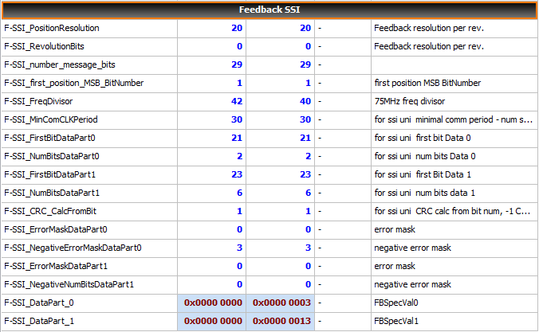

##Základní popis {#commonFB12}
Servozesilovač TGZ obsahuje ve standardním provedení (UNI) na konektoru **X6** a **X7** obvody pro připojení zpětné vazby pro osu 1, resp. osu 2.
Je možné připojit zpětnou vazbu typu Endat, SSI, BISS, inkrementální enkodér a po aplikaci propojky FBSELx také Hiperface DSL.   

Zjednodušené vnitřní schéma zapojení je na obrázku níže.

{: style="width:80%;" }

Jedná se o 2 velmi rychlé budiče sběrnice RS485 schopné pracovat s datovým tokem až 20 Mbit/s.

!!! note "Délka kabelu"
	Maximální přenosová rychlost klesá s délkou zpětnovazebního kabelu.
	V rámci zvýšení odolnosti zařízení proti rušení se ujistěte, že používáte originální kabel vhodné délky.
	Zbytečně dlouhý kabel (rezervní smyčky/klubka) může zapříčinit snížení odolnosti zařízení.

Každá linka RS485 je interně symetricky zakončena odporem 112 Ω.
Dále je zde soufázová tlumivka pro větší odolnost komunikace vůči rušení.
Konektor X6 a X7 je reprezentován piny 1-8.   

!!! warning "Firmware"
	Ujistěte se, že pro zvolený typ zpětné vazby používáte správný firmware.
	Kontaktujte dodavatele pro další podrobnosti.
	
##Podporované polohové snímače
###[Hiperface DSL](https://www.hiperfacedsl.com/index_en.html)
{: style="width:10%;" } je čistě digitální protokol, vyžadující minimální počet vodičů mezi servozesilovačem a motorem.
Robustnost tohoto protokolu umožňuje použití jednokabelového motoru, tj. výkonové i datové vodiče jsou v jednom kabelu.
Přenáší se pouze digitální absolutní poloha bez jakýchkoliv analogových signálů. Napájení i data jsou přenášeny pomocí jednoho páru vodičů.
Snímače se vyrábějí s rozlišením 15 až 24 bitů na otáčku (více-otáčkové provedení – 4 096 otáček).
Tento typ zpětné vazby se používá u motorů s jedním konektorem nebo kabelem.   

V případě, že požadujeme tento typ zpětné vazby, je potřeba na servozesilovači TGZ propojit piny 1-3 a 2-4 konektoru X6, resp. X7.
Tím se propojí signál RS_485_2 s výstupním obvodem pro napájení linky.
Poté stačí připojit vhodný snímač na piny 7-8.   

Příklady propojení servozesilovače a motoru jsou k dispozici v sekci `Ostatní | Schémata kabelů`   

- [Připojení motoru s konektorem ITEC](../../CZ/ETC/TGcable/md/description.md#Z1)
- [Připojení motoru s konektorem 08p](../../CZ/ETC/TGcable/md/description.md#Z2)
- [Připojení motoru s konektorem CSTA 8p](../../CZ/ETC/TGcable/md/description.md#Z3)
- [Připojení motoru v kabelovém provedení (kabely volně)](../../CZ/ETC/TGcable/md/description.md#Z4)

###[Endat 2.2](https://endat.heidenhain.com/endat2)
{: style="width:10%;" } je čistě digitální protokol, vyžadující 6 vodičů (3 páry) mezi servozesilovačem a motorem.
Jedná se o diferenciální páry pro clock, data (synchronní) a jeden pár pro napájení (+12V).
Nepoužívá se tak obvod pro přenos napájení po datovém páru, jako u Hiperface DSL.
Přenáší se pouze digitální absolutní poloha bez jakýchkoliv analogových signálů.
Snímače se vyrábějí s rozlišením 18 až 25 bitů na otáčku (více-otáčkové provedení – 4 096 otáček).   

V případě, že požadujeme tento typ zpětné vazby, je potřeba k servozesilovači připojit na konektor X6, resp. X7 všechny výše zmíněné  signály.

Příklady propojení servozesilovače a motoru jsou k dispozici v sekci `Ostatní | Schémata kabelů`

- [Připojení motoru s konektorem ITEC](../../CZ/ETC/TGcable/md/description.md#Z10)
- [Připojení motoru s konektorem 12p](../../CZ/ETC/TGcable/md/description.md#Z9)
- [Připojení motoru v kabelovém provedení (kabely volně)](../../CZ/ETC/TGcable/md/description.md#Z11)

###[BISS-C](https://biss-interface.com/)
{: style="width:10%;" } je čistě digitální protokol, vyžadující 6 vodičů (3 páry) mezi servozesilovačem a motorem.
Jedná se o diferenciální páry pro clock, data (synchronní) a jeden pár pro napájení (+5V nebo +12V).
Nepoužívá se tak obvod pro přenos napájení po datovém páru, jako u Hiperface DSL.
Přenáší se pouze digitální absolutní poloha bez jakýchkoliv analogových signálů.   

V případě, že požadujeme tento typ zpětné vazby, je potřeba k servozesilovači připojit na konektor X6, resp. X7 všechny výše zmíněné signály.
Pokud je snímač typu s napájením (+5V) je potřeba připojit napájecí vodiče do konektoru X5 na příslušné vývody.

Příklady propojení servozesilovače a motoru jsou k dispozici v sekci `Ostatní | Schémata kabelů`

- [Připojení snímače SSI/BISS s napájením +12V](../../CZ/ETC/TGcable/md/description.md#Z15)
- [Připojení snímače SSI/BISS s napájením +5V - volné vývody](../../CZ/ETC/TGcable/md/description.md#Z16)
- [Připojení snímače SSI/BISS v kabelovém provedení a napájení +5V](../../CZ/ETC/TGcable/md/description.md#Z14)

Níže najdete příklad nastavení parametrů polohový snímač RLS AksIM-2, 20 bitů, snímač polohy MB053DCC20BEDT00.

{: style="width:80%;" }

!!! note "CDS bit"

	Bit CDS je pro ostatní parametry považován za bit č. 0 zprávy.
	
{: style="width:60%;" }

**Popis parametrů**   

- `F-Type` - 6 .. Biss kodér, 7 .. SSI kodér
- `F-SSI_PositionResolution` - počet bitů polohy ve zprávě =resolution
- `F-SSI_RevolutionBits` - počet bitů pro počítání otáček v případě víceotáčkových snímačů
- `F-SSI_number_message_bits` - počet bitů celé zprávy. V případě Biss-C bez start bitu.
- `F-SSI_first_position_MSB_BitNumber` - číslo bitu prvního bitu obsahujícího polohu. Počáteční bit se nepočítá (není součástí).
- `F-SSI_FreqDivisor` - dělitel komunikační frekvence.  Výpočet F = 75Mhz / F-SSI_FreqDivisor
- `F-SSI_MinComCLKPeriod` - minimální perioda dotazování na polohu. Uvádí se v počtu clock period. Je to parametr pro senzory, které nejsou schopny dosáhnout maximální (možné) frekvence.
- `F-SSI_FirstBitDataPart0` - číslo bitu prvního bitu volitelné datové části telegramu 0. Počáteční bit se nepočítá (není součástí).
- `F-SSI_NumBitsDataPart0` - délka volitelné části DATA 0.
- `F-SSI_FirstBitDataPart1` - číslo bitu prvního bitu volitelné části DATA telegramu 1. Počáteční bit se nepočítá (není součástí).
- `F-SSI_NumBitsDataPart1` - délka nepovinné části DATA 1.
- `F-SSI_CRC_CalcFromBit` - číslo bitu prvního bitu, ze kterého se počítá CRC. Pokud je nastaveno -1, CRC se nevypočítává. Délka CRC musí být 6 bitů na konci zprávy. Polynom x6 +x1 +x0.  
- `F-SSI_ErrorMaskDataPart0`, `F-SSI_ErrorMaskDataPart1` - Masky pro zpětnou indikaci chyby. Pokud je nastavený bit v Masce shodný s odpovídajícím bitem v F-SSI_DataPart_x, je indikována chyba zpětné vazby.
- `F-SSI_NegativeErrorMaskDataPart0`, `F-SSI_NegativeErrorMaskDataPart1` - Masky pro indikaci chyby zpětné vazby. Pokud je nastavený bit v masce totožný s odpovídajícím invertovaným bitem v F-SSI_DataPart_x, je indikována chyba zpětné vazby.  

!!! note „Chyba zpětné vazby“

	Pro indikaci chyby zpětné vazby je nutné správně nastavit odpovídající parametry `F-SSI_FirstBitDataPartx` a `F-SSI_NumBitsDataPartx` a tato funkce musí být čidlem podporována.    
	
!!! note „Nastavené parametry“

	Některé parametry jsou akceptovány ihned po nastavení, ale doporučuje se je uložit a restartovat TGZ.
