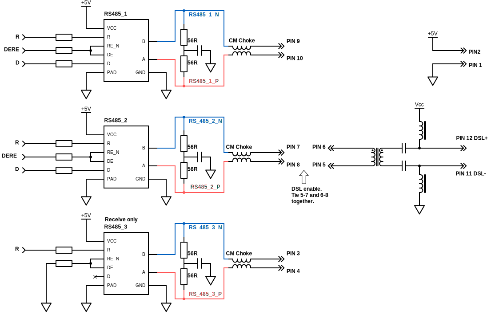

##Basic Description {#commonFBE}
The TGZ servoamplifier includes external feedback circuitry on the **X5** connector as standard (UNI).
It is possible to connect Endat, SSI, BISS, incremental encoder feedback and, after application of the FBSELx jumper, also a Hiperface DSL.
In addition, there is a 5V/1A power supply available on pins 1-2 for various purposes.
The most common use is to power the 5V position sensors.   

A simplified internal wiring diagram is shown in the figure below.

{: style="width:80%;" }

These are 3 very fast RS485 bus drivers capable of operating at data rates up to 20 Mbit/s.

!!! note "Cable length"
	The maximum baud rate decreases with the length of the feedback cable.
	To increase the interference immunity of the device, make sure to use the original cable of the appropriate length.
	An unnecessarily long cable (spare loop/cable) may cause a reduction in the device's EMI immunity.

Each RS485 line is internally symmetrically terminated with a 112 Ω resistor.
In addition, there is a common mode choke for greater immunity to the EMI.
The X6 and X7 connector is represented by pins 1-12 in the schematic.    

In case of a Hiperface DSL feedback, pins 5-7 a 6-8 need to be connected together.
This will connect the RS_485_2 signal to the line power output circuit.
Then just connect a suitable Hiperface DSL position sensor at pins 11-12.

The RS485_3 bus driver is connected unidirectionally only (data reception only).
It is most often used to read the "zero" pulse.

!!! warning "Firmware"
	Make sure that you use the correct firmware for the selected feedback type.
	Contact your supplier for further details.